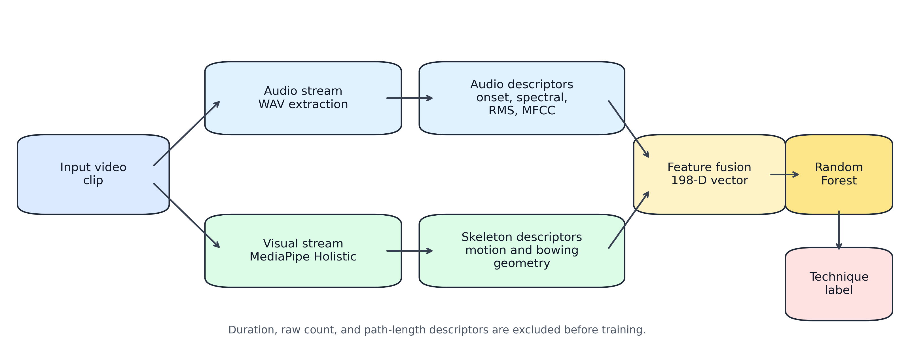

# Multimodal Violin Technique Recognition

This repository contains a research prototype for recognizing violin techniques
from ordinary performance videos using audio descriptors and MediaPipe-based
skeleton features.



## Research Snapshot

| Dataset | Task | Strongest reported result |
| --- | --- | --- |
| 147 usable clips | Six-class violin-technique recognition | **96.08 macro-F1** under source-video-group cross-validation |

The project compares audio-only, skeleton-only, and multimodal features. The
multimodal model is strongest in the reported grouped split, which is a more
meaningful stress test than randomly splitting clips from the same source
video.

## Public Repository Scope

This public code release contains the feature extraction, training, evaluation,
tests, data/model cards, and paper figures needed to understand the work. It
does **not** include raw videos, prepared WAV files, trained binary models,
annotation media, application materials, defense materials, or thesis/PDF
exports. Those assets can carry copyright, privacy, or environment-specific
constraints and are deliberately excluded by `.gitignore`.

The current task is **technique recognition**, not full automated performance
grading. The model predicts one dominant technique label for each short clip:

- pizzicato: plucked-string articulation (folder: `boxian`)
- stopped bowing / dungong: short separated bowed notes with clear stop-and-start attacks (folder: `dungong`)
- plain playing: ordinary bowed playing without the five target special techniques (folder: `plain`)
- vibrato: periodic left-hand pitch modulation (folder: `rouxian`)
- double stops: two strings sounded simultaneously (folder: `shuangyin`)
- spiccato: bounced off-string bowing (folder: `tiaogong`)

Tremolo (`chanyin`) is excluded from the reported six-class experiment because
only one usable sample is currently available.

## Why This Project Matters

Violin technique is expressed through both sound and body motion. Audio features
capture attacks, timbre, energy, and spectral patterns, while skeleton features
capture right-hand bowing movement, left-hand periodic motion, and upper-body
pose. Combining both modalities provides a compact, reproducible example of
audio-visual machine learning for music education technology.

## Current Results

The current experiment uses 147 usable clips and a Random Forest classifier with
400 trees. Duration, raw landmark-count, onset-count, and path-length features
are excluded from the final training matrix to reduce recording-length leakage.
The clips were collected from publicly accessible violin performance and
teaching videos on Bilibili and YouTube, then processed locally into WAV audio
and MediaPipe skeleton CSV files for an internal academic prototype. The raw
videos and prepared audio files should not be redistributed without permission
and copyright review.

For label-quality checking, a stratified subset of 48 clips was audited with
source-video-grouped out-of-fold model suggestions. The suggestions matched the
original labels for 45 of the 48 audited clips (93.75%) and flagged three clips
for manual review. This is an internal consistency check, not independent human
or teacher annotation.

| Split | Modality | Accuracy | Balanced Accuracy | Macro-F1 |
| --- | --- | ---: | ---: | ---: |
| Stratified clip CV | Audio only | 91.84 ± 1.67 | 91.77 ± 1.16 | 91.66 ± 1.92 |
| Stratified clip CV | Skeleton only | 91.84 ± 1.67 | 91.90 ± 2.37 | 91.57 ± 2.38 |
| Stratified clip CV | Multimodal | 96.60 ± 0.96 | 96.46 ± 1.45 | 96.43 ± 1.29 |
| Source-video-group CV | Audio only | 90.48 ± 3.85 | 89.20 ± 3.99 | 89.51 ± 4.23 |
| Source-video-group CV | Skeleton only | 91.84 ± 2.89 | 92.30 ± 2.52 | 92.28 ± 2.55 |
| Source-video-group CV | Multimodal | 95.92 ± 1.67 | 96.04 ± 1.88 | 96.08 ± 1.75 |

Generated outputs:

- `tmp_out/paper_experiment_results.csv`
- `tmp_out/paper_experiment_results.json`
- `tmp_out/paper_statistical_tests.csv`
- `tmp_out/paper_cross_modal_errors.csv`
- `tmp_out/paper_feature_importance.csv`
- `system_framework.png`
- `confusion_matrix.png`
- `feature_importance.png`

The locally generated annotation artifacts and compiled PDF are excluded from
the public repository together with raw/derived media.

## Reproduce the Experiment

This project currently runs with Anaconda Python on Windows.

One-command experiment reproduction:

```powershell
powershell -NoProfile -ExecutionPolicy Bypass -File scripts\reproduce.ps1
```

The script regenerates experiment outputs, paper figures, and test results. PDF
compilation is optional because local LaTeX installations may need user-level
MiKTeX setup:

```powershell
powershell -NoProfile -ExecutionPolicy Bypass -File scripts\reproduce.ps1 -BuildPdf
```

Equivalent manual commands:

```powershell
D:\Anaconda\python.exe paper_experiments.py
D:\Anaconda\python.exe plot_paper_figures.py
pdflatex -interaction=nonstopmode paper_draft.tex
pdflatex -interaction=nonstopmode paper_draft.tex
D:\Anaconda\python.exe -m pytest tests
```

The first command trains the final model and regenerates experiment outputs. The
second command regenerates paper figures from saved CSV/JSON outputs. The two
LaTeX commands compile the paper and refresh cross-references.

## Predict One Clip

```powershell
D:\Anaconda\python.exe predict_violin_technique.py `
  --wav prepared\boxian\01\right01-1.wav `
  --csv prepared\boxian\01\right01-1_violin_skeleton.csv
```

## Important Files

- `extract_violin_skeleton.py`: MediaPipe Holistic skeleton extraction.
- `prepare_violin_multimodal.py`: prepare audio and skeleton files from videos.
- `violin_feature_utils.py`: audio and skeleton feature extraction utilities.
- `train_multiclass_violin_techniques.py`: six-class model training pipeline.
- `paper_experiments.py`: paper-ready ablation and grouped CV experiments.
- `plot_paper_figures.py`: figure generation for the paper.
- `DATA_CARD.md`: dataset provenance, labeling, and release limitations.
- `MODEL_CARD.md`: model purpose, evaluation, and intended-use limitations.
- `docs/REPRODUCIBILITY.md`: what a new contributor needs in order to rerun
  the project with authorized local data.

## Limitations

The current dataset is small and internally collected from online platform
videos. The source-video-grouped split checks recoverable source-video paths,
but verified performer and piece metadata are not yet available. Copyright,
creator permission, and privacy status are not complete enough for public raw
media release. The labels are author-provided dominant-technique labels rather
than independently verified teacher rubrics or multi-annotator labels. The
project should therefore be presented as a multimodal technique-recognition
prototype, not as a complete automated grading system or public benchmark.
